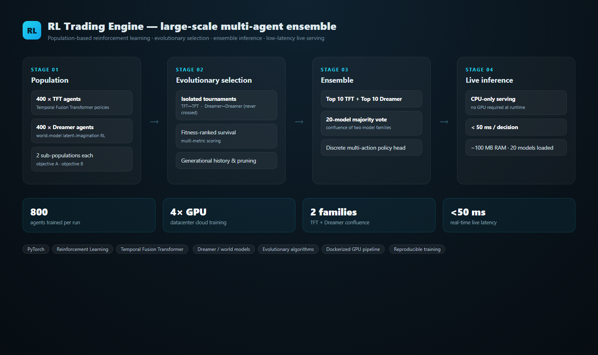

# 👋 AI / ML Engineer

> Ingénieur IA orienté **produit**. Je conçois, fine-tune et **livre** des
> systèmes d'IA jusqu'à l'application finie — du modèle à l'App Store.

*Identité volontairement privée. CV nominatif disponible sur demande directe.*

---

### 🚀 Just One Tap — App de traduction vocale (iOS · live App Store)

Pipeline IA **embarqué** : reconnaissance vocale → traduction → synthèse vocale.
24 langues, exécution **100 % on-device** (zéro surchauffe), 4 modes
(Solo / Duo / Caméra / Texte).

| | | | |
|---|---|---|---|
|  |  |  |  |

---

### 🤖 FRAPZ — Système multi-agents IA

Console d'orchestration **multi-agents** : 9 agents spécialisés répartis sur un
workflow en 3 phases (Discovery → Activation → Production), avec portes de
décision Go/No-Go, suivi tokens/coût et synthèse agrégée.

---

### 📈 RL Trading Engine — ensemble multi-agents à grande échelle

Pipeline de **reinforcement learning population-based** : 800 agents (TFT +
Dreamer) entraînés par tournois évolutifs isolés, puis ensemble des 20
meilleurs en vote majoritaire. Inférence **live CPU < 50 ms/décision**.
Entraînement GPU cloud dockerisé et reproductible.

---

### 🧠 Domaines

`LLM fine-tuning` · `Speech AI (STT / TTS / voice cloning)` · `On-device & mobile AI`
`Model quantization & optimization` · `Neural Machine Translation` · `Multi-agent systems`
`GPU cloud training`

### 🛠️ Stack

**Langages** Python · TypeScript · MQL4
**ML** PyTorch · Transformers · faster-whisper · XTTS / StyleTTS2 / Kokoro · Chatterbox
**Mobile** React Native · Expo · iOS on-device (ANE / CoreML / MLKit)
**Infra** Vast.ai (RTX 5090 / H100) · DDP · FastAPI · GitHub Actions (CI iOS) · OTA

---

### 📦 Autres projets

| Projet | Description | État |
|---|---|---|
| **Moteur voix multilingue** | TTS / clonage vocal 23 langues, streaming temps réel, VAD robuste au bruit. | R&D |
| **Fine-tune TTS FR** | Dataset ~100h, LoRA, entraînement multi-GPU cloud, pipeline reproductible. | R&D |

🎬 Loisir : clip musical animé généré par IA (modèles de diffusion + Remotion).

---

### 📫 Contact

Échanges via recruteur — **contact direct uniquement** (pas de réseaux sociaux par choix).
