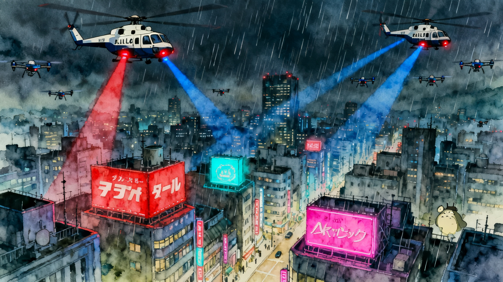

# 👋 AI / ML Engineer

> Ingénieur IA orienté **produit**. Je conçois, fine-tune et **livre** des
> systèmes d'IA jusqu'à l'application finie — du modèle à l'App Store.

*Identité volontairement privée. CV nominatif disponible sur demande directe.*

---

### 🧰 Stack globale

| Catégorie | Technologies |
|---|---|
| **Langages** | Python · TypeScript · JavaScript · MQL4 |
| **ML / DL** | PyTorch · Transformers · Reinforcement Learning (TFT, Dreamer) · STT / TTS / voice cloning · NMT |
| **Mobile** | React Native · Expo · iOS on-device (ANE / CoreML / MLKit) |
| **LLM / Agents** | Anthropic API · OpenAI API · RAG (LlamaIndex, ChromaDB) · orchestration multi-agents |
| **Infra** | Vast.ai GPU (RTX 5090 / H100 / RTX PRO 6000) · Docker · CUDA · FastAPI · GitHub Actions (CI iOS) · cloudflared |

> Chaque projet ci-dessous indique **sa propre stack** — les choix techniques diffèrent selon les contraintes (embarqué, temps réel, entraînement GPU…).

---

## 🗣️ Speech & Voice AI

### 🚀 Just One Tap — App de traduction vocale (iOS · live App Store)

Application iOS de traduction **conçue et livrée seul**, du prototype à la
publication sur l'App Store. Pipeline IA **100 % embarqué** : reconnaissance
vocale → traduction → synthèse vocale, **sans aucun serveur** (confidentialité
totale, fonctionne hors-ligne après le premier téléchargement de modèle).
**24 langues**, **4 modes** : *Solo* (appui maintenu), *Duo* (conversation
face-à-face), *Caméra* (OCR + traduction de menus/textes imprimés), *Texte*.
Optimisé pour tourner sur l'**Apple Neural Engine** → traduction quasi
instantanée et **zéro surchauffe** même sur iPhone 12. Industrialisé : build
CI iOS automatisé et déploiement de correctifs **OTA** sans repasser par la
revue Apple.

| | | | | |
|:-:|:-:|:-:|:-:|:-:|
|  |  |  |  |  |

> **Stack ·** `TypeScript` · `React Native` · `Expo` · `iOS Speech (STT on-device)` · `MLKit Translate (ANE)` · `Apple TTS` · `OCR caméra` · `GitHub Actions (CI iOS)` · `EAS OTA`

---

## 🧠 LLM · RAG · Agents

### 🔎 RAG bancaire sécurisé — assistant conformité

Assistant **RAG sécurisé** pour la conformité bancaire (banque fictive de
démo). Ingestion locale de documents (**AML / RGPD / guide interne**),
indexation vectorielle **ChromaDB** (embeddings MiniLM) et récupération
orchestrée par **LlamaIndex**, génération de la réponse par **Claude** avec
**citation systématique des sources**. Accent mis sur la **sécurité LLM** :
*garde-fou d'entrée* (détection d'injection de prompt, blocklist) et
*garde-fou de sortie* (contrôle de la réponse avant retour). Le tout exposé
en **API FastAPI** + dashboard, **dockerisé**, avec **suite de tests pytest**
et CI — démontre une approche *production* du RAG, pas un simple prototype.

> **Stack ·** `Python` · `FastAPI` · `LlamaIndex` · `ChromaDB` · `embeddings MiniLM` · `Claude (Anthropic)` · `guardrails I/O` · `Docker` · `GitHub Actions (CI)` · `pytest`

---

### 🤖 FRAPZ — Système multi-agents IA

Console d'**orchestration multi-agents** pilotant **9 agents spécialisés** +
un agent *Captain* qui coordonne l'ensemble. Workflow structuré en **3 phases**
(Discovery → Activation → Production) avec **portes de décision Go/No-Go**
entre chaque phase : un agent ne démarre que si la porte précédente est
validée. Multi-fournisseurs (**Anthropic + OpenAI**), **suivi des tokens et du
coût** en temps réel, **synthèse agrégée** des sorties d'agents et génération
de livrables. Front léger Alpine.js / Tailwind — illustre la **conception de
systèmes agentiques** (rôles, dépendances, garde-fous d'orchestration).

> **Stack ·** `JavaScript` · `Alpine.js` · `Tailwind CSS` · `Anthropic API` · `OpenAI API` · `orchestration multi-agents` · `Telegram Bot API`

---

## 📈 Reinforcement Learning

### RL Trading Engine — ensemble multi-agents à grande échelle

Pipeline de **reinforcement learning population-based** à grande échelle :
**800 agents** entraînés par run, répartis sur **deux familles de modèles**
(400 *Temporal Fusion Transformer* + 400 *Dreamer*, RL à imagination latente),
chacune en deux sous-populations optimisant des objectifs différents. Sélection
par **tournois évolutifs isolés** (une famille ne combat jamais l'autre),
survie classée par fitness multi-métrique sur plusieurs générations, puis
**ensemble des 20 meilleurs** (10 + 10) décidant par **vote majoritaire** —
la confluence des deux familles fait la robustesse. Politique d'action
**discrète multi-choix**. Entraînement **4× GPU datacenter** (cloud) dans un
pipeline **dockerisé et reproductible** ; **inférence live CPU uniquement,
< 50 ms/décision**, ~100 Mo RAM, branchée en temps réel via un pont dédié.

> **Stack ·** `Python` · `PyTorch` · `Temporal Fusion Transformer` · `Dreamer (world-model RL)` · `algorithmes évolutionnaires` · `CUDA` · `Docker` · `Vast.ai 4× RTX PRO 6000` · `pont live MQL4`

---

## 🎬 Creative & Automation

### Generative Video Studio — pipeline vidéo automatisé

**Agent d'orchestration** maison qui automatise une chaîne de production vidéo
de bout en bout. Pilote l'**API Seedance** (text-to-video & image-to-video)
avec **retry/backoff** et **suivi de coût**, génère automatiquement
**plusieurs branches/variantes par scène** (multi-seed) puis sélectionne les
meilleures. Assemble ensuite le **montage Remotion** synchronisé (timeline,
transitions, calage paroles/scènes), applique le **post-traitement** (upscale,
encodage) et **exporte en multi-format** (horizontal + vertical réseaux
sociaux). L'intégration API a été développée sur mesure. Couplé à une
**création visuelle et direction artistique** maison (conception des prompts,
chartes, retouches).

Exemples de rendus générés par le pipeline :

| | |
|:-:|:-:|
|  |  |

> **Stack ·** `Python` · `API Seedance (I2V / T2V)` · `agent d'orchestration` · `Remotion` · `TypeScript` · `FFmpeg` · `upscaling`
>
> **Création ·** `Photoshop` · `design / direction artistique` · `création web (HTML / CSS / JS)`

---

## 🧠 Domaines de compétence

`LLM fine-tuning` · `Speech AI (STT / TTS / voice cloning)` · `On-device & mobile AI`
`Model quantization & optimization` · `Neural Machine Translation` · `RAG & guardrails`
`Multi-agent systems` · `Reinforcement Learning` · `GPU cloud training`

🎬 Loisir : clip musical animé généré par IA — <code>modèles de diffusion</code> · <code>Remotion</code>.

---

## 📫 Contact

Échanges via recruteur — **contact direct uniquement** (pas de réseaux sociaux par choix).
